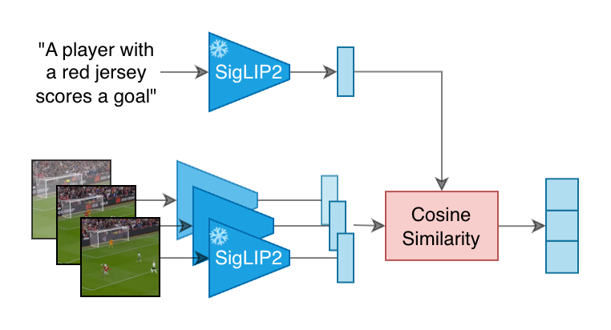
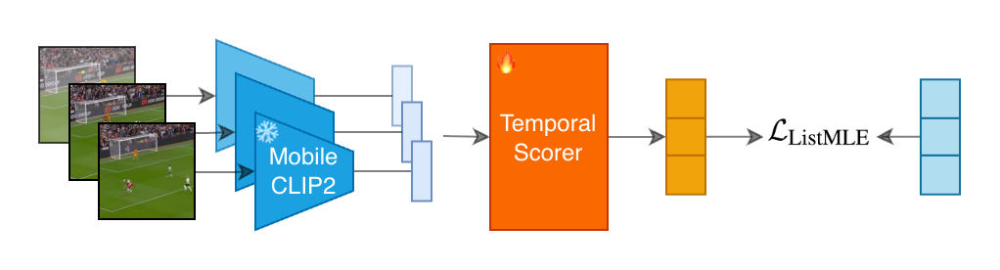

# PEEK: Picking Essential frames via Efficient Knowledge distillation

Official implementation of [**PEEK: Picking Essential frames via Efficient Knowledge distillation**](https://arxiv.org/abs/2605.31029).

<p align="center">
  <a href="#"></a>
  <a href="#"></a>
  <a href="https://huggingface.co/momentslab/peek"></a>
  <a href="https://huggingface.co/spaces/momentslab/peek"></a>
  <a href="LICENSE"></a>
  <a href="https://creativecommons.org/licenses/by-nc-sa/4.0/"></a>
</p>

PEEK is a query-free frame selector for low-budget video captioning. It learns from a privileged caption-conditioned teacher, but at inference time it receives only video frames: no target caption, no prompt, and no text encoder. Given a budget of `k` frames, PEEK predicts per-frame relevance scores and returns the selected frames in temporal order, ready to be forwarded to a downstream Video-Language Model.

In our experiments, a single ActivityNet-trained PEEK checkpoint improves one-frame and two-frame CIDEr over uniform sampling across four captioning VLMs on ActivityNet Captions and MSR-VTT. The gains are strongest when the visual budget is tight; at larger budgets, uniform temporal coverage remains a strong baseline.

## How it works

The model is trained by distillation:

- **Stage 1 (teacher).** For every training segment we score every candidate frame against the ground-truth caption with a frozen [SigLIP2 SO400M patch14 384](https://huggingface.co/google/siglip2-so400m-patch14-384) dual encoder. We L2-normalize both pooler outputs and take the cosine similarity. These scores are min-max normalized per segment in `[0, 1]` and used **only as supervision**.
- **Stage 2 (student).** A 2-layer Transformer over frozen [MobileCLIP2-S0](https://github.com/apple/ml-mobileclip) frame embeddings is trained with the [ListMLE](https://www.machinelearning.org/proceedings/icml2008/papers/167.pdf) listwise ranking loss to reproduce the teacher's ranking. At inference time, the student uses only the visual evidence.

At test time we score every frame once and select `k` of them with **stratified argmax**: partition the video into `k` equal-width temporal buckets and pick the highest-scoring frame inside each bucket. For `k=1` this reduces to a plain argmax over the whole video.

<p align="center">
  
  
</p>

**Stage 1** uses SigLIP2 to produce caption-conditioned frame relevance targets.
**Stage 2** distills those rankings into a lightweight temporal scorer that uses MobileCLIP2 frame embeddings only.

## Release plan

This release currently includes the code and weights needed to train PEEK and run the released selector on new videos. The full downstream captioning evaluation pipeline used for the paper tables is still being prepared.

- [x] Training code for SigLIP2 teacher target generation and PEEK distillation.
- [x] Single-video inference CLI and Python API.
- [x] ActivityNet-trained `peek_base` weights on [Hugging Face](https://huggingface.co/momentslab/peek).
- [ ] ActivityNet Captions test-set evaluation code.
- [ ] MSR-VTT test-set evaluation code.

## Repository layout

```
peek/
├── assets/
│   ├── peek_phase1.png             # Stage 1 diagram
│   └── peek_phase2.png             # Stage 2 diagram
├── configs/peek_base.yaml          # released-model training config
├── LICENSE                         # Apache-2.0 (code)
├── scripts/
│   ├── prepare_manifest.py         # build a JSONL manifest from ANC annotations
│   ├── extract_frames.py           # ffmpeg → 2 fps JPEG frames
│   ├── compute_teacher_targets.py  # SigLIP2 teacher targets (Stage 1)
│   ├── precompute_embeddings.py    # frozen MobileCLIP2 frame embeddings
│   ├── train.py                    # train PEEK (Stage 2)
│   └── infer.py                    # run a pretrained checkpoint on one video
└── src/peek/
    ├── data.py        # SegmentRecord + ANC ingestion + manifest I/O
    ├── frames.py      # ffmpeg frame extraction
    ├── teacher.py     # SigLIP2 teacher scoring
    ├── encoder.py     # MobileCLIP2 frozen visual tower
    ├── model.py       # PeekScorer (the architecture)
    ├── losses.py      # ListMLE
    ├── dataset.py     # PeekSegmentDataset for training
    ├── selection.py   # stratified_argmax / topk / uniform
    ├── inference.py   # high-level video → selected frames API
    └── train.py       # main training loop
```

## Installation

```bash
git clone https://github.com/momentslab/peek
cd peek
python3.12 -m venv .venv && source .venv/bin/activate
pip install -e .
```

PyTorch ≥ 2.1 is required. CUDA is strongly recommended (training is feasible on a single GPU, but `precompute_embeddings.py` and `compute_teacher_targets.py` are the rate-limiters).

## Quick start: run the pretrained model

The pretrained weights are hosted on the Hugging Face Hub at
[`momentslab/peek`](https://huggingface.co/momentslab/peek) and are downloaded
(and cached) automatically on first use — you don't need to fetch anything
manually. Score any video with:

```bash
python scripts/infer.py path/to/video.mp4 --k 4
```

This will:
1. Download `peek_base.safetensors` from Hugging Face (first run only).
2. Decode `video.mp4` at 2 fps into a temporary directory.
3. Encode every frame with frozen MobileCLIP2-S0.
4. Score every frame with PEEK.
5. Pick 4 frames with stratified argmax and print their indices, timestamps, and scores.

To use your own checkpoint instead, pass `--checkpoint path/to/weights.safetensors`
(`.pt` training checkpoints are also accepted).

You can also call the inference pipeline directly from Python:

```python
from pathlib import Path
from peek.inference import load_peek_pipeline, select_frames_from_video

# checkpoint_path=None -> download the pretrained weights from Hugging Face.
encoder, scorer, device = load_peek_pipeline(variant="s0", device="cuda")
output = select_frames_from_video(
    Path("video.mp4"),
    encoder=encoder, scorer=scorer, device=device,
    k=4, fps=2.0,
)
print(output.selected_indices, output.selected_timestamps_sec)
```

> **Note on licensing.** The code in this repository is Apache-2.0, but the
> pretrained weights on Hugging Face are released under CC-BY-NC-SA-4.0
> (**non-commercial**). See [License](#license) below.

## Reproducing selector training

The steps below reproduce the PEEK selector training pipeline.

You will need:
- The **ActivityNet Captions** annotations (`train.json`, `val_1.json`, `val_2.json`); see [the ANC release](https://cs.stanford.edu/people/ranjaykrishna/densevid/).
- The corresponding **ActivityNet** video files (one per video id). They can be dowloaded from [this Hugging Face repository](https://huggingface.co/datasets/friedrichor/ActivityNet_Captions).
- A GPU. The full pipeline on the train and val split takes roughly one day on one GB10; most of the time is in SigLIP2 + MobileCLIP2 precomputation, then training for 25 epochs takes about 30 minutes).

### 1. Build JSONL manifests

```bash
python scripts/prepare_manifest.py \
    --annotations-root /path/to/ActivityNetCaptions/annotations \
    --videos-root      /path/to/ActivityNetCaptions/videos      \
    --annotation-files train.json                                \
    --output-manifest  data/manifests/train.jsonl

python scripts/prepare_manifest.py \
    --annotations-root /path/to/ActivityNetCaptions/annotations \
    --videos-root      /path/to/ActivityNetCaptions/videos      \
    --annotation-files val_1.json                                \
    --output-manifest  data/manifests/val.jsonl
```

### 2. Decode candidate frames at 2 fps (this can take a long time depending on your number of CPUs available)

```bash
python scripts/extract_frames.py \
    --manifest    data/manifests/train.jsonl \
    --output-root data/anc_train             \
    --fps 2.0 --workers 8

python scripts/extract_frames.py \
    --manifest    data/manifests/val.jsonl \
    --output-root data/anc_val             \
    --fps 2.0 --workers 8
```

### 3. SigLIP2 teacher targets (Stage 1)

```bash
python scripts/compute_teacher_targets.py \
    --manifest    data/manifests/train.jsonl \
    --output-root data/teacher                \
    --split-name  train                       \
    --frames-root data/anc_train/frames       \
    --no-embeddings   # we only need the JSON targets

python scripts/compute_teacher_targets.py \
    --manifest    data/manifests/val.jsonl \
    --output-root data/teacher              \
    --split-name  val                       \
    --frames-root data/anc_val/frames       \
    --no-embeddings
```

### 4. MobileCLIP2-S0 frame embeddings (Stage 2 inputs)


```bash
python scripts/precompute_embeddings.py \
    --manifest    data/manifests/train.jsonl \
    --frames-root data/anc_train/frames      \
    --output-root data/embeddings/train      \
    --variant s0

python scripts/precompute_embeddings.py \
    --manifest    data/manifests/val.jsonl \
    --frames-root data/anc_val/frames      \
    --output-root data/embeddings/val      \
    --variant s0
```

### 5. Train PEEK

`configs/peek_base.yaml` already points at the paths above:

```bash
python scripts/train.py --config configs/peek_base.yaml
```

The training run writes to `runs/peek/peek_base/`:
- `checkpoints/checkpoint_best.pt` — best validation Spearman.
- `checkpoints/checkpoint_last.pt` — latest epoch (used with `--resume`).
- `metrics.jsonl` — one row per step / per epoch.
- `config.json` — the fully-resolved config for this run.

## Notes on the pretrained model

The pretrained weights ([`momentslab/peek`](https://huggingface.co/momentslab/peek),
`peek_base.safetensors`) are not stored in this repository; see
[License](#license) for why.

- The released checkpoint is trained on **ActivityNet Captions `train.json`** segments only.
- Encoder: **MobileCLIP2-S0** (frozen), 512-d features per frame, via [`apple/MobileCLIP2-S0`](https://huggingface.co/apple/MobileCLIP2-S0) loaded with `open_clip`.
- Teacher: **SigLIP2 SO400M patch14 384** (frozen).
- Loss: ListMLE on min-max normalized teacher cosines.
- Inference selection policy: **stratified argmax**.
- Augmentation recipe: frame drop in `[0.05, 0.25]`, minimum temporal crop fraction `0.7`, at most `32` frames after augmentation, and at least `6` frames retained.

## Citation

```bibtex
@inproceedings{steunou2026peek,
  title={{PEEK}: Picking Essential frames via Efficient Knowledge distillation},
  author={Steunou, Killian and Filali Razzouki, Anas and Guetari, Khalil and El-Yacoubi, Mounîm A. and Tevissen, Yannis},
  year={2026},
  url={https://arxiv.org/abs/2605.31029}
}
```

## License

PEEK uses a **split license** for code and model weights:

| Artifact | Location | License |
| --- | --- | --- |
| **Code** (this repository) | [github.com/momentslab/peek](https://github.com/momentslab/peek) | [Apache-2.0](LICENSE) |
| **Pretrained weights** (`peek_base.safetensors`) | [huggingface.co/momentslab/peek](https://huggingface.co/momentslab/peek) | [CC-BY-NC-SA-4.0](https://creativecommons.org/licenses/by-nc-sa/4.0/) |
